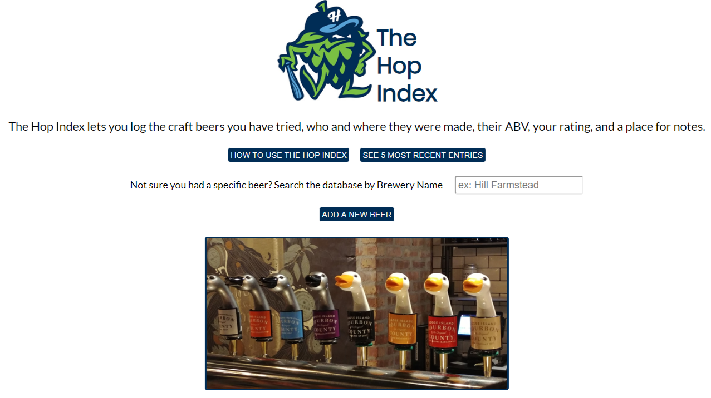
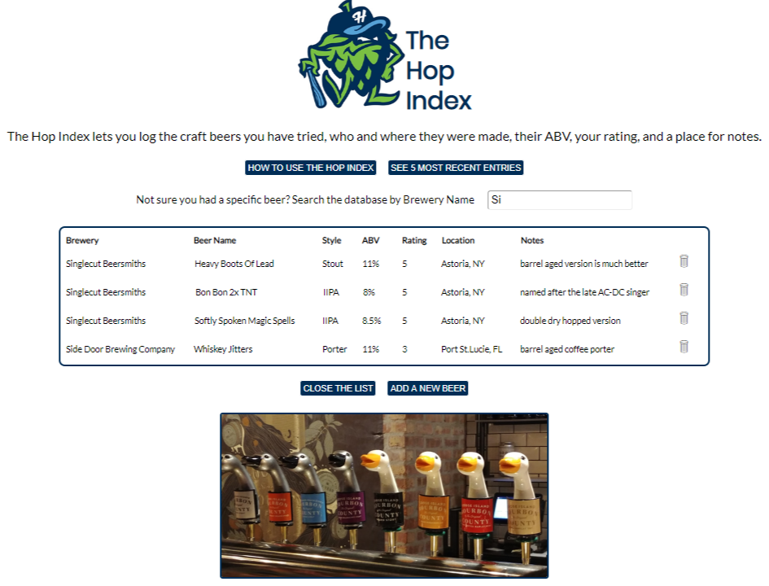
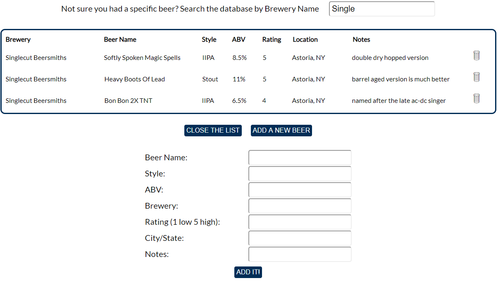
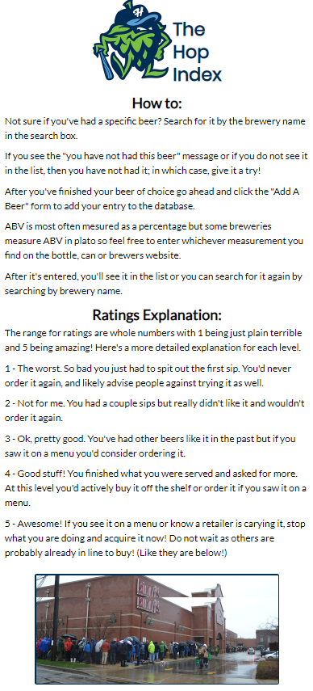
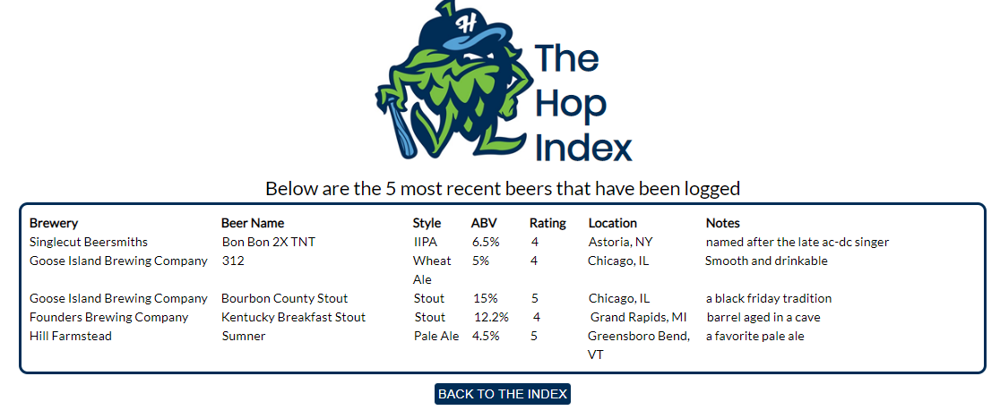

# The Hop Index
The Hop Index allows an easy way to determine if I have tried a particular beer as the craft beer movement around the world has exploded with new options coming out on a daily basis. The landing page features a search by brewery box that will first bring back all of the beers I have tried but as soon as you start typing in the name of a brewery the results list will filter on the fly. At that point I'll know if I have had a particular beer I'm contemplating on ordering or buying. If I have had it it'll show me the necessary information. The name, what style it is, the ABV%, who brewed it, the rating I gave it, the location of where it was brewed and any specific notes about it that I wanted to remember like it if was barrel aged or brewed with something specific like fruit or nuts etc. If I have not had a beer that I'm being offered I can click the Add A Beer button and enter the necessary info. There is also a button to take me to the 5 most recent beers I've had as well as a button to take me to a How To Use the app with instructions and explanations of the ratings.

## Demo
[Live Demo] (https://shrouded-sierra-74421.herokuapp.com/)

## Screenshots
Landing Page 

Search Results view 

Add A Beer form 

How To Use The Hop Index page 

5 Most Recent Entries page 

## Front End
- HTML5
- CSS3
- JavaScript
- React
- Redux

## Back End
- Node.js
- Express.js
- MongoDB
- Mongoose
- mLab database
- Mocha and Chai for testing

## Hosting
- Heroku

## Continious Integration / Build Server
- Travis CI
